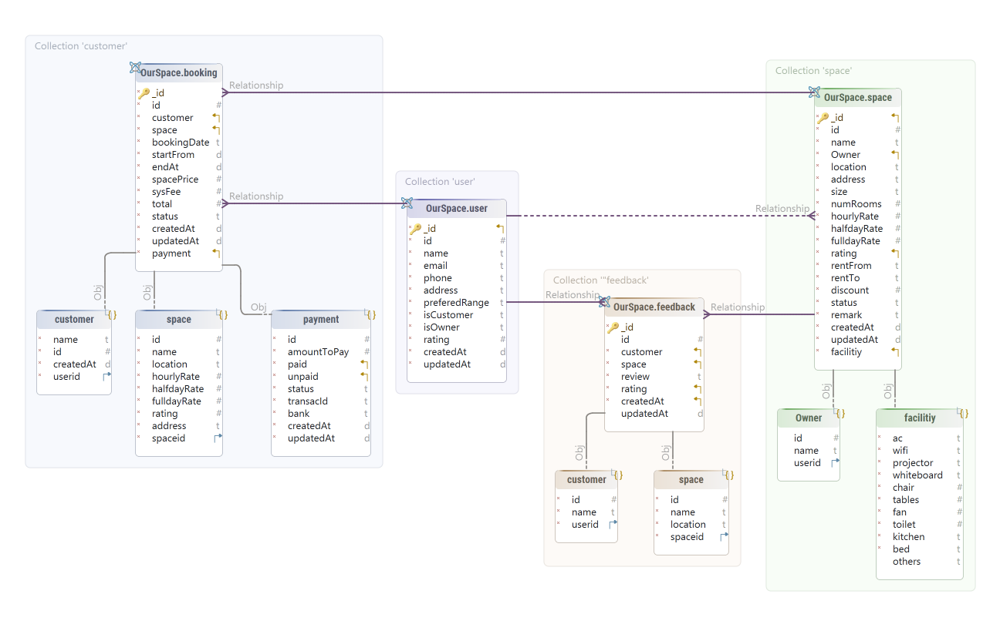

# Document Model Implementation

This directory contains the implementation of a space rental management system using a document-oriented database model (MongoDB).

## Overview

The document model approach organizes data in flexible, JSON-like documents, allowing for:
- Embedded documents for related data
- Dynamic schema evolution
- Rich querying capabilities
- Efficient handling of hierarchical data structures

## Database Schema

### Core Collections

1. **Users**
```json
{
  "_id": {
    "$oid": "67bca321a88c21f2dc648c9b"
  },
  "id": 1,
  "name": "Alice Johnson",
  "email": "alice.johnson@example.com",
  "phone": "9876543210",
  "address": "5678 Oak St",
  "preferedRange": "5 - 10",
  "isCustomer": true,
  "isOwner": false,
  "rating": 4.2,
  "createdAt": "2021-02-15 10:30:00",
  "updatedAt": "2021-06-10 14:20:00"
}
```

2. **Spaces**
```json
{
  "id": 8,
  "name": "Space H",
  "Owner": {
    "id": 5,
    "name": "Ethan Wright",
    "userid": {
      "$oid": "67bca321a88c21f2dc648c9f"
    }
  },
  "location": "Suburbs",
  "address": "4567 Cedar Rd",
  "size": "160",
  "numRooms": 3,
  "hourlyRate": 13,
  "halfdayRate": 115,
  "fulldayRate": 210,
  "rating": 4.4,
  "rentFrom": "07:00:00",
  "rentTo": "18:00:00",
  "discount": 0.18,
  "status": "open",
  "remark": "Quiet and peaceful space",
  "createdAt": {
    "$date": "2021-11-15T00:00:00.000Z"
  },
  "updatedAt": {
    "$date": "2021-11-15T00:00:00.000Z"
  },
  "facilitiy": {
    "ac": true,
    "wifi": true,
    "projector": true,
    "whiteboard": false,
    "chair": 10,
    "tables": 5,
    "fan": 2,
    "toilet": 1,
    "kitchen": true,
    "bed": false
  }
}
```

3. **Bookings**
```json
{
  "id": 1,
  "customer": {
    "name": "Natalie Carter",
    "id": 14,
    "createdAt": {
      "$date": "2021-03-19T14:45:00.000Z"
    },
    "userid": {
      "$oid": "67bca321a88c21f2dc648ca8"
    }
  },
  "space": {
    "id": 1,
    "name": "Space A",
    "location": "Downtown",
    "hourlyRate": 10,
    "halfdayRate": 100,
    "fulldayRate": 180,
    "rating": 4.5,
    "address": "1234 Main St",
    "spaceid": {
      "$oid": "67bc9e44a88c21f2dc648c9a"
    }
  },
  "bookingDate": "2025-01-10",
  "startFrom": {
    "$date": "2025-01-02T10:00:00.000Z"
  },
  "endAt": {
    "$date": "2025-01-02T12:00:00.000Z"
  },
  "spacePrice": 20,
  "sysFee": 0.6,
  "total": 20.6,
  "status": "booked",
  "createdAt": {
    "$date": "2024-01-01T01:00:00.000Z"
  },
  "updatedAt": {
    "$date": "2025-02-27T06:26:50.778Z"
  },
  "payment": {
    "id": 1,
    "amountToPay": 20.6,
    "paid": 20.6,
    "unpaid": 0,
    "status": "paid",
    "transacId": "1234567890",
    "bank": "Chase",
    "createdAt": {
      "$date": "2025-01-01T01:00:00.000Z"
    },
    "updatedAt": {
      "$date": "2025-01-01T01:00:00.000Z"
    }
  }
}
```
4. **Feedback**
```json
{
  "id": 11,
  "customer": {
    "id": 11,
    "name": "Kevin Rogers",
    "userid": {
      "$oid": "67bca321a88c21f2dc648ca5"
    }
  },
  "space": {
    "id": 11,
    "name": "Space K",
    "location": "Downtown",
    "spaceid": {
      "$oid": "67bc9ce8a88c21f2dc648c90"
    }
  },
  "review": "Very spacious, perfect for conferences.",
  "rating": 4.9,
  "createdAt": "2021-05-03 00:00:00"
}
```
 
## Entity Relationship Diagram


 

## Key Features

1. **Embedded Documents**
   - Reviews embedded within spaces for faster retrieval
   - Payment information embedded in bookings
   - Location details nested within space documents

2. **Referential Integrity**
   - User references in bookings and reviews
   - Space references in bookings

3. **Indexing Strategy**
   - Geospatial indexing on space locations
   - Compound indexes on booking dates and status
   - Text indexes on space descriptions for search

## Advantages

1. **Flexibility**
   - Easy schema evolution
   - Supports varying space attributes
   - Accommodates different payment methods

2. **Performance**
   - Fast retrieval of complete booking information
   - Efficient space search with geospatial queries
   - Quick access to embedded reviews

3. **Scalability**
   - Horizontal scaling capabilities
   - Efficient for read-heavy operations
   - Good for distributed systems

## Limitations

1. **Transaction Support**
   - Limited ACID compliance compared to relational databases
   - Complex transactions require additional application logic

2. **Data Redundancy**
   - Some data duplication in embedded documents
   - Requires careful management of consistency

## Sample Queries

1. **Find Available Spaces**
```javascript
db.spaces.find({
  "location.area": "Downtown",
  "availability.slots": {
    $elemMatch: {
      start: { $gte: new Date() }
    }
  }
})
```

2. **Get User Bookings with Space Details**
```javascript
db.bookings.aggregate([
  { $match: { userId: userId } },
  { $lookup: {
      from: "spaces",
      localField: "spaceId",
      foreignField: "_id",
      as: "space"
  }}
])
```

## Directory Structure

- `/mock_data`: Sample data sets for testing
- `/script`: Database scripts
- `/Documentation`: Additional documentation and guides
- `/export`: Exported Data
