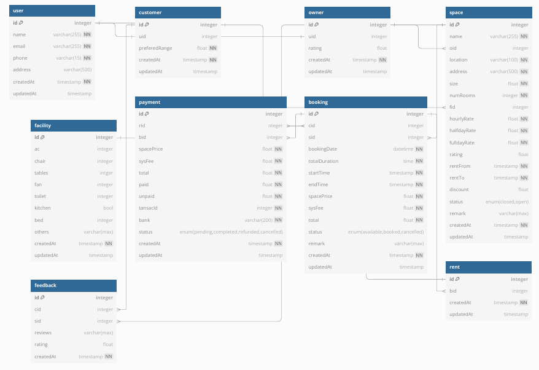

# Relational Data Modeling

## Overview
This directory contains the relational data modeling implementation for a space rental management system. The relational model uses structured tables with predefined schemas and relationships through foreign keys.

## Database Schema

### Core Tables
1. **Users**
   - UserID (PK)
   - Name
   - Email
   - Phone
   - Address
   - PreferredRange
   - NumOfBookings
   - TotalSpent
   - CreatedAt
   - UpdatedAt

2. **Spaces**
   - SpaceID (PK)
   - OwnerID (FK)
   - Name
   - Address
   - Size
   - NumRooms
   - HourlyRate
   - HalfdayRate
   - FulldayRate
   - RentFrom
   - RentTo
   - Status
   - Rating
   - Remark
   - CreatedAt
   - UpdatedAt

3. **Bookings**
   - BookingID (PK)
   - UserID (FK)
   - SpaceID (FK)
   - BookingDate
   - TotalDuration
   - SpacePrice
   - SystemFee
   - TotalPrice
   - Status
   - Remark
   - CreatedAt
   - UpdatedAt

### Supporting Tables
4. **Payments**
   - PaymentID (PK)
   - BookingID (FK)
   - UserID (FK)
   - Amount
   - TransactionID
   - Bank
   - Status
   - CreatedAt
   - UpdatedAt

5. **Feedback**
   - FeedbackID (PK)
   - UserID (FK)
   - SpaceID (FK)
   - Rating
   - Review
   - CreatedAt
   - UpdatedAt

6. **TimeSlots**
   - SlotID (PK)
   - BookingID (FK)
   - TimeSlot
   - CreatedAt
   - UpdatedAt

## Entity Relationship Diagram



## Key Features
- **Referential Integrity**: Enforces data consistency through foreign key constraints
- **ACID Properties**: Ensures reliable transaction processing
- **Normalized Structure**: Minimizes data redundancy
- **Complex Joins**: Enables sophisticated data retrieval across multiple tables
- **Data Validation**: Enforces data type constraints and business rules

## Sample Queries

### 1. Get User Booking History
```sql
SELECT 
    b.BookingID,
    s.Name AS SpaceName,
    b.BookingDate,
    b.TotalPrice,
    b.Status
FROM Bookings b
JOIN Spaces s ON b.SpaceID = s.SpaceID
WHERE b.UserID = ?
ORDER BY b.BookingDate DESC;
```

### 2. Calculate Space Revenue
```sql
SELECT 
    s.Name,
    COUNT(b.BookingID) as TotalBookings,
    SUM(b.SpacePrice) as TotalRevenue
FROM Spaces s
LEFT JOIN Bookings b ON s.SpaceID = b.SpaceID
GROUP BY s.SpaceID, s.Name;
```

## Advantages
1. **Data Consistency**: Strong data integrity through constraints
2. **Standardization**: Well-established practices and tools
3. **Query Flexibility**: Powerful SQL language for data manipulation
4. **Transaction Support**: ACID compliance for reliable operations
5. **Tool Ecosystem**: Wide range of management and analysis tools

## Limitations
1. **Schema Rigidity**: Changes require careful migration planning
2. **Complex Relationships**: Many-to-many relationships need junction tables
3. **Scaling Challenges**: Vertical scaling can be costly
4. **Join Performance**: Complex joins can impact performance
5. **Object-Relational Impedance**: Mismatch with object-oriented programming

## Use Cases
- Traditional business applications
- Financial systems
- Inventory management
- Any system requiring strict data consistency
